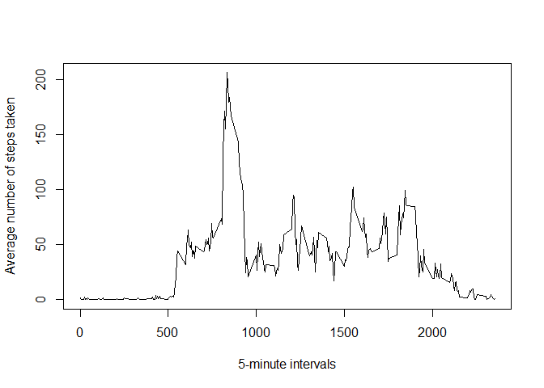
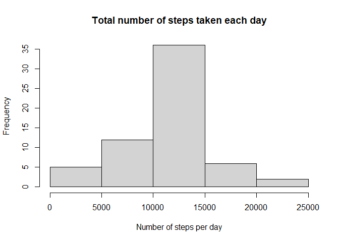
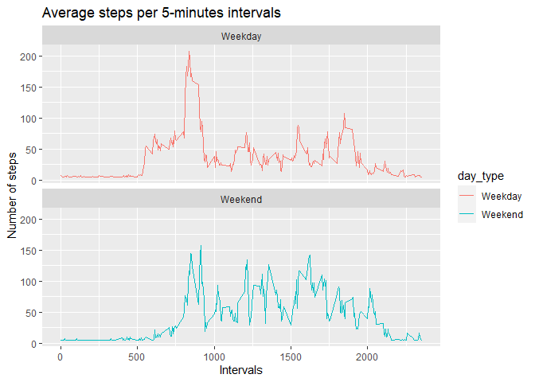

Introduction
------------

It is now possible to collect a large amount of data about personal
movement using activity monitoring devices such as a Fitbit, Nike
Fuelband, or Jawbone Up. These type of devices are part of the
“quantified self” movement – a group of enthusiasts who take
measurements about themselves regularly to improve their health, to find
patterns in their behavior, or because they are tech geeks. But these
data remain under-utilized both because the raw data are hard to obtain
and there is a lack of statistical methods and software for processing
and interpreting the data. This assignment makes use of data from a
personal activity monitoring device. This device collects data at 5
minute intervals through out the day. The data consists of two months of
data from an anonymous individual collected during the months of October
and November, 2012 and include the number of steps taken in 5 minute
intervals each day.

In this assignment, we were requested to ask a series of questions.

Loading and preprocessing the data
----------------------------------

We forked then cloned the GitHub repository created for this assignment,
then loaded the data and had a quick exploration.

    unzip("activity.zip")
    activity<-read.csv("activity.csv")
    head(activity)

    ##   steps       date interval
    ## 1    NA 2012-10-01        0
    ## 2    NA 2012-10-01        5
    ## 3    NA 2012-10-01       10
    ## 4    NA 2012-10-01       15
    ## 5    NA 2012-10-01       20
    ## 6    NA 2012-10-01       25

We imported required packages

    library(ggplot2)
    library(dplyr)

    ## 
    ## Attaching package: 'dplyr'

    ## The following objects are masked from 'package:stats':
    ## 
    ##     filter, lag

    ## The following objects are masked from 'package:base':
    ## 
    ##     intersect, setdiff, setequal, union

What is mean total number of steps taken per day?
-------------------------------------------------

Calculate the total number of steps taken per day:

    dailysteps<-aggregate(steps~date, activity, sum)

Build the histogram of the total number of steps taken each day:

    hist(dailysteps$steps, xlab="Number of steps per day", 
         ylab="Frequency", main="Total number of steps taken each day")

Calculate and report the mean and median of the total number of steps
taken per day

    mean(dailysteps$steps)

    ## [1] 10766.19

    median(dailysteps$steps)

    ## [1] 10765

What is the average daily activity pattern?
-------------------------------------------

Make a time series plot (i.e. 𝚝𝚢𝚙𝚎 = “𝚕”) of the 5-minute interval
(x-axis) and the average number of steps taken, averaged across all days
(y-axis)

    IntervalSteps<-aggregate(steps~interval, data=activity, mean, na.rm=TRUE)
    plot(steps~interval, data=IntervalSteps, type="l", xlab="5-minute intervals", ylab=("Average number of steps taken"))

Which 5-minute interval, on average across all the days in the dataset,
contains the maximum number of steps?

    IntervalSteps[which.max(IntervalSteps$steps), ]$interval

    ## [1] 835

Imputing missing values
-----------------------

Calculate and report the total number of missing values in the dataset
(i.e. the total number of rows with 𝙽𝙰s)

    Missing <- sum(is.na(activity$steps))
    print(Missing)

    ## [1] 2304

Devise a strategy for filling in all of the missing values in the
dataset. The strategy does not need to be sophisticated. For example,
you could use the mean/median for that day, or the mean for that
5-minute interval, etc.

=&gt; let’s fill in all of the missing values in the dataset by the mean
number of steps per interval

    m<-mean(IntervalSteps$steps)

Create a new dataset that is equal to the original dataset but with the
missing data filled in

    activitynona<- transform(activity, steps = ifelse(is.na(activity$steps), m, activity$steps))
    head(activitynona)

    ##     steps       date interval
    ## 1 37.3826 2012-10-01        0
    ## 2 37.3826 2012-10-01        5
    ## 3 37.3826 2012-10-01       10
    ## 4 37.3826 2012-10-01       15
    ## 5 37.3826 2012-10-01       20
    ## 6 37.3826 2012-10-01       25

Make a histogram of the total number of steps taken each day and
calculate and report the mean and median total number of steps taken per
day. Do these values differ from the estimates from the first part of
the assignment? What is the impact of imputing missing data on the
estimates of the total daily number of steps?

Histogram:

    dailystepsnona<-aggregate(steps~date, activitynona, sum)
    hist(dailystepsnona$steps, xlab="Number of steps per day", 
         ylab="Frequency", main="Total number of steps taken each day")

Calculate and report the mean and median of the total number of steps
taken per day

    mean(dailystepsnona$steps)

    ## [1] 10766.19

    median(dailystepsnona$steps)

    ## [1] 10766.19

Imputing missing data has no impact on mean and non material impact
(0.01%) on median.

Are there differences in activity patterns between weekdays and weekends?
-------------------------------------------------------------------------

Create a new factor variable in the dataset with two levels – “weekday”
and “weekend” indicating whether a given date is a weekday or weekend
day.

    activitynona$date <- as.Date(strptime(activitynona$date, format="%Y-%m-%d"))
    activitynona1 <- mutate(activitynona, "day_type"= ifelse(weekdays(activitynona$date)=="samedi" | weekdays(activitynona$date)=="dimanche", "Weekend", "Weekday"))
    head(activitynona1)

    ##     steps       date interval day_type
    ## 1 37.3826 2012-10-01        0  Weekday
    ## 2 37.3826 2012-10-01        5  Weekday
    ## 3 37.3826 2012-10-01       10  Weekday
    ## 4 37.3826 2012-10-01       15  Weekday
    ## 5 37.3826 2012-10-01       20  Weekday
    ## 6 37.3826 2012-10-01       25  Weekday

Make a panel plot containing a time series plot (i.e. 𝚝𝚢𝚙𝚎 = “𝚕”) of the
5-minute interval (x-axis) and the average number of steps taken,
averaged across all weekday days or weekend days (y-axis). See the
README file in the GitHub repository to see an example of what this plot
should look like using simulated data.

    IntervalStepsnona<-aggregate(steps~interval+day_type, data=activitynona1, mean)
    plot <- ggplot(IntervalStepsnona, aes(x = interval , y = steps, color=day_type)) + facet_wrap(~day_type, ncol = 1, nrow=2) +
      geom_line()+labs(title="Average steps per 5-minutes intervals", x="Intervals", y="Number of steps")
    print(plot)

